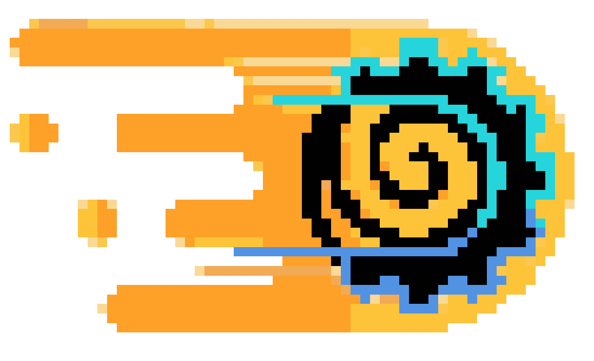

<table align="center">
  <tr>
    <td></td>
    <td><h1>Bala: A 2D Bullet Heaven Game Engine</h1></td>
  </tr>
</table>

<p>Bala is a 2D bullet heaven game engine built with Java and LWJGL designed to help novice developers easily create top-down games. It features procedural generation using Simplex and Perlin Noise collision detection with AABB and circle-circle methods and flocking AI for NPC behavior. The engine also includes tools for performance testing through frame time logs.</p>

<h2>🛠️ Installation Steps:</h2>

<p>1. Java (version 11 to 16) and Gradle (version 5.0 to 8.14)</p>

- Install Java (version 11 to 16) and Gradle (version 5.0 to 8.14) on your environment path.

<p>2. Clone Repository</p>

- Use this command on your terminal to clone the repository.

```
git clone https://github.com/aiaiaiex/bala.git
```

<p>4. Change directory to the repository folder</p>

- Use this command on your terminal to change directory to the repository folder.

```
cd bala
```

<p>5. Run the Game Engine</p>

- Use this command on your terminal to run the game engine.

```
gradlew run
```

<h2>©️ Credits</h2>

- **Game Sounds**: [plasterbrain](https://freesound.org/people/plasterbrain/) (licensed under Creative Commons CC0 1.0 Universal)
- **Sprite Assets**: [Kenney](https://kenney.nl/assets/tiny-battle) (licensed under	Creative Commons CC0 1.0 Universal)